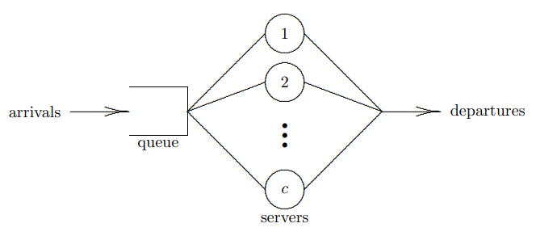
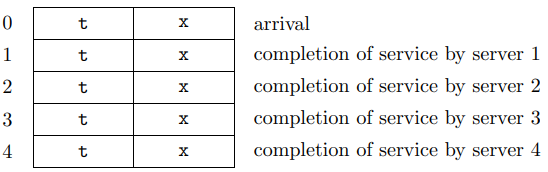
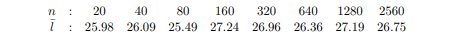
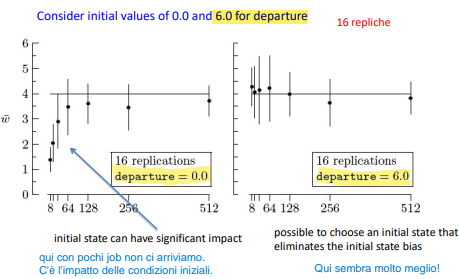

# Next event

gli approcci a `discrete-event simulation` non si adattano facilmente all'aumento di complessità dei modelli e non generalizzano bene i sistemi.
`Next-event simulation` è un approccio più generale basato su:

- stato del sistema;
- eventi;
- orologio di simulazione;
- scheduling degli eventi;
- lista degli eventi (calendario).

## Stato del sistema

Completa caratterizzazione del sistema in un istante di tempo.
Può essere caratterizzato dal valore assegnato alle variabili (**state variables**).

> **Approccio:** concentrarsi sullo stato del sistema che evolve nel tempo.
> 
> - **CONCEPTUAL MODEL LEVEL:** stato del sistema esiste in astratto (quali sono le variabili di stato e come sono correlate tra loro? Come evolvono nel tempo?).
> - **SPECIFICATION LEVEL:** stato del sistema dato da variabili matematiche con equazioni e logica che descrivono le interazioni tra esse e la loro evoluzione nel tempo.
> - **COMPUTATIONAL LEVEL:** variabili descrivono lo stato e vengono aggiornate in base al passare del tempo.

> **ESEMPIO:** numero di jobs in un single-server service node.

## Eventi

Gli **eventi** sono occorrenze che potrebbero cambiare lo stato del sistema. Lo stato può cambiare solo in presenza di eventi. Ogni evento ha un suo **event type**.

> **NOTA:** Non necessariamente un evento fa modificare lo stato del sistema:
> 
> - possono essere schedulati per campionare lo stato del sistema.
> - in caso di coda con feedback immediato un completamento cambia lo stato solo se il job non è feedback.
> - evento schedulato per fare cut-off dello stream degli arrivi.
> - nel caso di sistema di inventario una revisione cambia stato solo in presenza di ordini.

> **ESEMPIO:** single-server service node model due tipi di eventi: arrivi (aumenta numero di job nel sistema) e partenze (se non c'è feedback diminuisce numero di job nel sistema) (potrebbero cambiare lo stato del sistema).

## Clock di simulazione

Poichè un discrete-event simulation è dinamico è necessario simulare il tempo che passa. Per fare questo si utilizza una floating point variable (t, time, tnow o clock).
Questa variabile è chiamara la `simulation clock`.

## Event Scheduling

In un modello discrete-event simulation è necessario utilizzare un meccanismo avanzato per il tempo in modo da garantire che gli eventi si verifichino nell'ordine corretto (clock non va all'indietro).
Il meccanismo utilizzato solitamente è next-event time advance utilizzato insieme a event-scheduling. 
Se **event scheduling** è utilizzato insieme a next-event time-advance mechanism il risultato è chiamato **next-event simulation model**.

Per costruire un next-event simulation model devono essere fatte tre cose:

- costruire un set di variabili di stato che danno una descrizione del sistema;
- identificare i tipi di eventi nel sistema;
- costruire una collezione di algoritmi che definiscono i cambi di stato che hanno luogo dopo un determinato tipo di evento.
  I cambi di stato occorrono immediatamente (clock freezzato).

## Lista degli eventi

Struttura dati che rappresenta il tempo schedulato di occorenze per i prossimi eventi possibili di ogni tipo.

# Next-event simulation

**Next-event simulation model** consiste di 4 steps:

- **Inizializzazione:**: clock inizializzato (di solito a 0), viene determinata e programmata la prima occorenza che si verifica per ogni tipo di evento inizializzando l'elenco degli eventi.
- **Process current event:** si scorre la lista degli eventi per determinare il più imminente. Il clock di simulazione viene poi avanzato al tempo dell'evento selezionato e lo stato del sistema modificato come conseguenza dell'*evento corrente*.
- **Schedulazione di un nuovo evento:** eventi che possono essere generati dall'evento corrente vengono aggiunti alla lista degli eventi.
- **Terminazione:** il processo di avanzamenro del clock di simulazione continua finché non si verifica una condizione di terminazione (es. pseudo-evento che occorre una sola volta alla fine della simulazione).

## Single-server service node

La variabile di stato l(t) fornisce una caratterizzazione completa dello stato di un single-server service node:

- l(t)=0 $\iff$ q(t)=0 and x(t)=0
- l(t)>0 $\iff$ q(t)=l(t)-1 and x(t)=1
  l(t) rappresenta il numero nei nodi, q(t) nelle code, x(t) in servizio al tempo t>0.

l(t) viene incrementato di 1 a seguito di un arrivo e viene decrementato di 1 a seguito di un evento di completamento.

Per rendere questo modello next-event concettuale in un specification model devono essere fatte tre ulteriori assunzioni:

- **stato iniziale** l(0) può avere qualsiasi valore non negativo, solitamente si utilizza 0 ("empty and idle"). Il primo evento deve essere un arrivo.

- Anche lo **stato finale** deve essere non negativo, è buona norma comunque che anche questo sia idle.
  Si può assumere che le porte vengano chiuse ad un tempo $\tau$ a partire dal quale non si possono più avere ingressi nel sistema.

- **eventi impossibili** possono essere gestiti o senza inserirli nella lista degli eventi (soprattuto se il numero di tipi di eventi è grande), o utilizzando la costante "$\infty$".

- **t** è il simulation clock

- **$\tau$** è il tempo di terminazione

- **$t_a$** è il tempo di arrivo

- **$t_c$** è il tempo di completamento

- l è il numero nei nodi

**ALGORITMO** (su cui si basa anche ssq3)

```c
l = 0; /* initialize the system state */
t = 0.0; /* initialize the system clock */
ta = GetArrival(); /* initialize the event list */
tc = ∞; /* initialize the event list */
while ((ta < τ) or (l > 0)) { /* check for terminal condition */
    t = min(ta, tc); /* scan the event list */
    if (t == ta) { /* process an arrival */
        l++;
        ta = GetArrival();
        if (ta > τ)
            ta = ∞;
        if (l == 1)
            tc = t + GetService();
    }
    else { /* process a completion of service */
        l--;
        if (l > 0)
            tc = t + GetService();
        else
            tc = ∞;
    }
}
```

- **GetArrival():** ritorna un valore random di istante di arrivo;
- **GetService():** ritorna un valore random di istante di servizio.
  
  > **NOTA:** se la coda è M/M/1 con rate di arrivo 1.25 gli statement `ta=GetService()` possono essere sostituiti con `ta = t + Exponential(0.8)`. (Si può fare lo stesso ragionamento con i tempi di servizio tc).
  > Nell'esempio in più si hanno solo due tipi di eventi, non c'è bisogno di strutture per rappresentare la lista dei tipi di eventi; altrimenti si sarebbero potute utilizzare array o strutture.
  > $\infty$ è un qualsiasi numero molto più grande di $\tau$, ad esempio $100\tau$.

Se la lista degli eventi è grande e con taglia dinamica è richiesta una struttura dinamica (stando attenti al fatto che ogni volta che occorre un evento bisogna gestirla impattando così sulle prestazioni).

### ssq3

In `ssq3` in particolare si ha che t è una struttura le liste `t.arrival` (ta) e `t.completion` (tc), `t.current` (t, il clock), `t.next` (min(ta, tc), next event time), `t.last` (ultimo arrivo).

La struttura `area` è utilizzata per calcolare il tempo medio nei nodi, nelle code e di servizio. Questa contiene:

- **area.node:** $\int_{0}^{t} q(s) ds$
- **area.queue:** $\int_{0}^{t} l(s) ds$
- **area.service:** $\int_{0}^{t} x(s) ds$

Inoltre, non vengono accumulate le statistiche `job-averaged` ($\bar{w}\, \bar{d} e \bar{s}$) ma vengono calcolati solo i loro valori medi dai valori delle statistiche `time-averaged` ($\bar{l}\, \bar{q} e \bar{x}$) utilizzando le equazioni del Teorema 1.2.1 (per code FIFO, n job si ha $\int_{0}^{t} l(s) ds=\sum_{i=1}^{n}w_i$; $\int_{0}^{t} q(s) ds=\sum_{i=1}^{n}d_i$; $\int_{0}^{t} x(s) ds=\sum_{i=1}^{n}s_i$).

Il tempo medio di interarrivo $\bar{r}$ è calcolato a partire dalla definizione 1.2.4 ($\bar{r}=\frac{1}{n}\sum_{i=1}^{n}r_i=\frac{a_n}{n}$) utilizzando la variabile `t.last` (necessario perché t.arrival = INFINITY per la chiusura della porta).

`ssq2` a differenza di `ssq3` produce le statistiche job-averaged direttamente. Il primo si dice basato su `process-interaction` world view, il secondo su `event-scheduling` world view.

### Alternate Queue Disciplines

Per simulare qualsiasi disciplina di coda il programma può essere modificato utilizzando liste collegate in cui ogni nodo contiene tempo di arrivo e servizio per un job nella coda. `Enqueue` e `Dequeue` saranno le funzioni necessarie per inserire e rimuovere i job dalla coda.

### Finite service node capacity

ssq3 può essere modificato anche per avere code a capacità finita mantenendo però traccia tramite `rejected` dei job rigettati.
Per fare questo basta sostituire questo codice nel precedente per processare gli arrivi:

```c
if (t.current == t.arrival) { /* process an arrival */
    if (number < CAPACITY) {
        number++;
        if (number == 1)
            t.completion = t.current + GetService();
    }
    else
        reject++;
    t.arrival = GetArrival();
    if (t.arrival > STOP) {
        t.last = t.current;
        t.arrival = INFINITY;
    }
}
```

### Random Sampling

In ssq3 diventa semplice anche fare campionamento aggiungendo un elemento di sampling time `t.sample`. Si può costruire un campione ogni $\delta$ unità di tempo in modo deterministico o passare questo valore ad una esponenziale avendo così un tempo variabile.

# Multi-server service node (Msq)

Questo esempio ha tre obiettivi:

- un multi-server service node è una generalizzazione di un single-server service node;
- un multi-server service node ha una grande importanza pratica e teoretica;
- nel next-event simulation model di un multi-server service node la taglia della lista degli eventi è dettata dal numero di servers e, se questo numero è grande, la struttura dati per rappresentarla è importante.

Un multi-server service node consiste in una coda singola con due o più server che operano in parallelo.
In ogni istante di tempo lo stato di ogni server può essere *idle* o *busy* e lo stato della coda può essere *empty* o *not empty*. Se almeno un server è idle la coda deve essere vuota.

In questo caso se si ha un servente vuoto il job che arriva lo occupa. Non c'è collaborazione tra i serventi nei momenti di basso traffico.
Il controllo della coda è deteerminato dalla disciplina di coda.

## Regola selezione del servente

Un job che arriva può trovare più serventi liberi, in questo caso si utilizza una *server selection rule*.
Ci sono diverse possibilità: (le prime tre cercano di avere la stessa utilizzazione su tutti i servers, le ultime due comportano che ci sono server più utilizzati di altri)

- **Random selection:** seleziona randomicamente un server tra quelli idle.
- **Selection in order:** seleziona il primo server libero a partire dal primo.
- **Cyclic selection:** seleziona il primo server libero a partire dall'ultimo assegnato.
- **Equity selection:** seleziona il server libero da più tempo o con utilizzazione minore.
- **Priority selection:** sceglie il server "migliore" tra quelli idle. Bisogna avere un concetto di "migliore".

Per semplificare l'analisi matematica i server sono solitamente supposti uguali e indipendenti tra loro.
In questo caso la scelta della politica di selezione non impatta sulle prestazioni mentre può impattare sull'utilizzazione del singolo server.

### States

i server paralleli in un multi-server service node sono comunqmente chiamati *service channels*. 
Con c indichiamo il numero di servers (channel), con s=1, ..., c l'indice del server.

## Esempi Next-Event Simulation

Come per il single-server node la variabile di stato l(t) denota il numero di jobs nel service node al tempo t. Per un multi-server node con diversi servers questa singola variabile di stato non fornisce una descrizione completa dello stato.

- Se l(t) $\geq$ c, tutti i server sono pieni e q(t)=l(t)-c jobs sono nella coda;
- Se l(t) < c, per uno stato completo bisogna capire quali server sono busy e quali idle.

Definiamo $x_s8t)$ la variabile binaria che indica il numero di jobs in servizio sul server s al tempo t (0 idle, 1 busy).
Osserviamo poi che $q(t)=l(t)-sum_{s=1}^{c}x_s(t)$ è il numero di jobs nella coda al tempo t dato dalla differenza tra quelli in servizio e il numero di server busy.

### Events

Le c+1 variabili di stato danno una descrizione completa del multi-server service node.
Data questa descrizione completa ci chiediamo quali sono gli eventi che fanno cambiare le variabili di stato.
Se i server sono distinti esistono c+1 tipi di eventi (l'arrivo al service node o la partenza da uno dei server).
Se c'è un arrivo al tempo t, l(t) è incrementato di 1.

- Se l(t) $\leq$ c, un server idle viene selezionato e l'evento viene preso in carico da esso (e viene schedulato l'evento di completamento da parte di quel server);
- Se l(t) $\geq$ c, il job rimane in coda in attesa di un completamento;

Se si ha un completamento di un servizio di un server al tempo t allora l(t) viene decrementato di 1.

- Se l(t) $\geq$ c, un job viene selezionato dalla coda e viene preso in carico dal server idle;
- Se l(t) $\leq$ c, il server rimane idle.

Le ipotesi aggiuntive sono coerenti con quelle fatte per il single-server model.

- Stato iniziale del multi-server service node è empty e idle. Il primo evento dovrà essere un arrivo.
- C'è un tempo di terminazione $\tau$ giunti al quale non vengono più accettati gli arrivi ma vengono solo completati i servizi dei jobs nel sistema. Lo stato di terminazione è idle e empty.
- Tutti i server sono assunti indipendenti e statisticamente identici. Equity selection è assunta come regola di selezione del server.

### Event List

La lista degli eventi per questa next-event simulation model può essere organizzata come un array di `c+1` tipi di eventi indicizzati da 0 a c.

Il campo t in ogni struttura di eventi è il tempo schedulato della prossima occorrenza per quell'evento, il campo x è lo stato di attività corrente dell'evento (utilizzato come alternativa a $\infty$).
Per l'evento 0 x indica se gli arrivi sono attivi, per gli altri se i server sono occupati.
Un array è appropriato per la event list perché la taglia non può eccedere c+1.
Se c è grande è preferibile utilizzare una struttura dati a lunghezza variabile come una lista collegata contenente una lista degli eventi ordinata.
La lista degli eventi in questo caso dovrà essere partizionata tra busy e idle.

### Programma msq

Implementazione di next-event multi-server service node simulation model. Abbiamo:

- **number** è la variabile l(t);
- Le variabili di stato $x_s$ sono incorporate nella lista degli eventi;
- **area** è la statistica time-integrated $\int_{0}^{t}l(\theta)d\theta$
- **sum** contiene le strutture utilizzate per memorizzare per ogni server la somma dei tempi di servizio e il numero di servizi;
- **NextEvent** è utilizzato per cercare la lista degli eventi e determinare l'indice **e** del prossimo evento;
- **FindOne** è utilizzato per cercare la lista degli eventi per determinare l'indice **s** di un server libero che è stato idle per più tempo (equity selection rule).


# Batch Means

Trattasi di tecnica popolare per ridurre l'effetto dell'autocorrelazione nell'analisi dell'output. Questa tecnica coinvolge l'eliminazione di alcuni punti dati generati al fine di ridurre l'autocorrelazione tra le osservazioni rimanenti.
Prima di tutto, ricordiamo che *Statistiche steady state* o *infinite horizon* sono quelle statistiche prodotte simulando l'operatività di un sistema *stazionario* di tipo *discreto* per una quantità infinita di tempo.



Qui in figura, vediamo che, per $n$ che aumenta sempre di più, $l$ convergerà ad un valore approssimato di steady-state vicino $26.75$.
Però stiamo parlando di *approssimazione*, quindi un approccio migliore è quello di stimare $l$ sviluppando un *intervallo di stima* applicabile quando $n$ è grande e finito. E' proprio qui che entrano in gioco i *batch means*.

Nello stato stazionario simulo un tempo potenzialmente infinito PER QUEL SISTEMA, calcolo media campionaria finale di una statistica, ottengo un PUNTO DI STIMA, che però ci dice poco, e quindi vogliamo un vero e proprio intervallo di confidenza anche qui! Useremo metodo BATCH MEANS.

Una differenza tra *orizzonte finito* ed *orizzonte infinito* risiede nel fatto che, nel caso infinito, le condizioni iniziali *non* sono importanti, quindi c'è una perdita di memoria dello stato iniziale.
Le statistiche ad *nel transiente* sono prodotte da una simulazione a *tempo finito*.
Altra differenza è che nell'orizzonte infinito possiamo dire che il sistema rimanga *stazionario* (p.365), ovvero, preso ad esempio una M/M/1, arrivi e servizi sono assumibili come costanti nel tempo. Nell'orizzonte finito abbiamo invece un ambiente più dinamico.

Come visibile in foto, lo stato iniziale può essere più o meno impattante:



Quando il numero dei job è grande, la stima risulta buona ed essenzialmente indipendente dallo stato iniziale.

## Esempio

- Banca che apre alle 9 e chiude alle 17. Un simulazione a orizzonte finito nell'arco delle 8 ore produce statistiche transitorie che potrebbero essere preziose per determinare il numero ottimale di impiegati ai banchi durante la giornata. Caso **transiente**, orizzonte finito.
- Consideriamo invece un ristorante fast food con un'area per il servizio al volo che sperimenta un periodo di affluenza a pranzo tra le 11:45 e le 13:15 con un tasso di arrivo costante durante questo periodo di picco. Questo periodo di 90 minuti potrebbe essere simulato *per un periodo molto più lungo*, producendo statistiche **steady-state stazionarie** che potrebbero essere preziose per stimare il tempo medio di attesa alla finestra per il servizio al volo.

Le statistiche in stato stazionario sono più semplici da comprendere perché sono più facili da analizzare matematicamente utilizzando metodi analitici.

Le statistiche transitorie sono importanti perché lo stato stazionario è spesso una semplificazione conveniente: la maggior parte dei sistemi reali non opera abbastanza a lungo in un ambiente stazionario per produrre statistiche in stato stazionario.


<script type="text/javascript" src="http://cdn.mathjax.org/mathjax/latest/MathJax.js?config=TeX-AMS-MML_HTMLorMML">
</script>

<script type="text/x-mathjax-config">
        MathJax.Hub.Config({ tex2jax: {inlineMath: [['$', '$']]}, messageStyle: "none" });
</script>